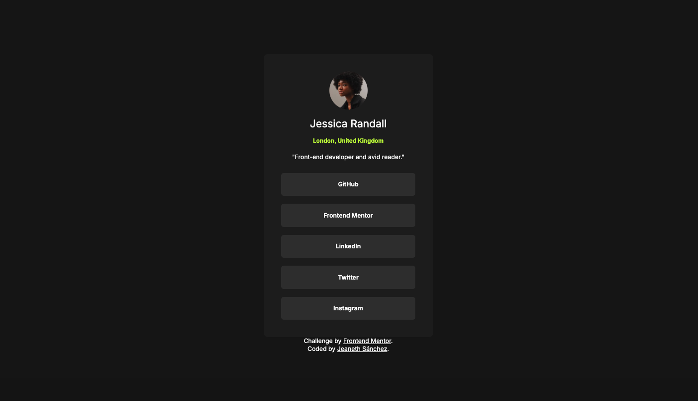

# Frontend Mentor - Social links profile solution

This is a solution to the [Social links profile challenge on Frontend Mentor](https://www.frontendmentor.io/challenges/social-links-profile-UG32l9m6dQ). Frontend Mentor challenges help you improve your coding skills by building realistic projects. 

## Table of contents

- [Overview](#overview)
  - [The challenge](#the-challenge)
  - [Screenshot](#screenshot)
  - [Links](#links)
- [My process](#my-process)
  - [Built with](#built-with)
  - [What I learned](#what-i-learned)
  - [Continued development](#continued-development)
- [Author](#author)
- [Acknowledgments](#acknowledgments)

## Overview

### The challenge

Users should be able to:

- See social card component hover and focus states for all interactive elements on the page

### Screenshot

### Links

- Solution URL: [https://github.com/jeanethsn/social-links-profile-main]
- Live Site URL: [https://jeanethsn.github.io/social-links-profile-main/]

## My process

### Built with

- Semantic HTML5 markup
- CSS custom properties
- Flexbox
- Mobile-first workflow

### What I learned

I have been practicing css without using so many divs. Also  semantic HTMl and use font size and spacing variables.

### Continued development

I want to start making components with javascript

## Author

- Website - [https://jeanethsanchez.com/]
- Frontend Mentor - [https://www.frontendmentor.io/profile/jeanethsn]

## Acknowledgments
 Is better to think how will be the design and beging to use varibales. Also put * styles in css for removing margin and padding. 

